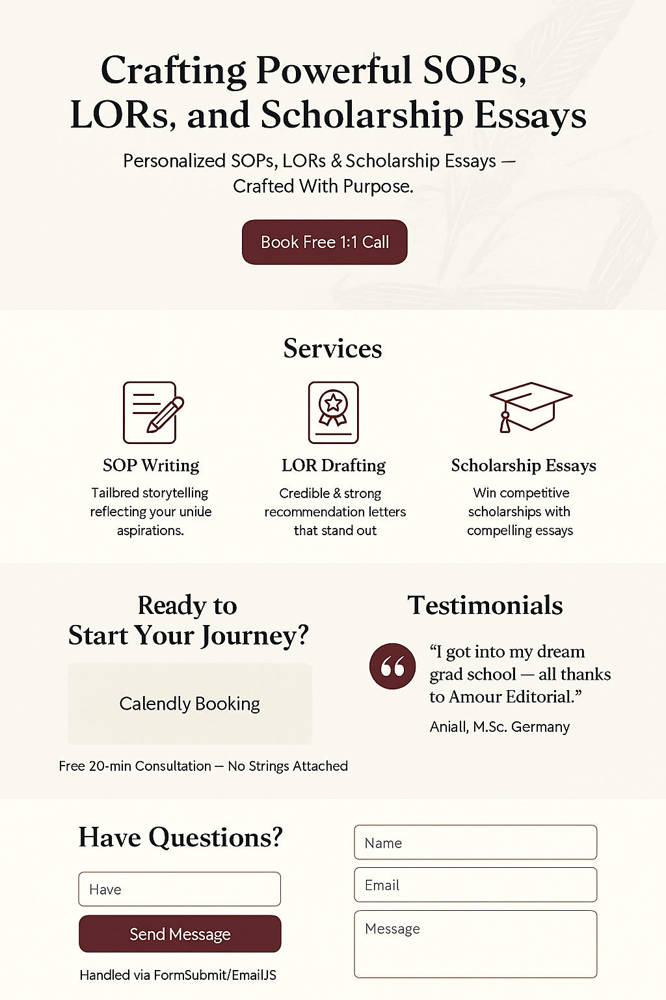

# ✍️ Amour Editorials

**Amour Editorials** is a professional platform that helps students and professionals craft compelling Statements of Purpose (SOPs), Letters of Recommendation (LORs), and other academic documents — turning their dreams into impactful stories.

## Deployment link
https://amour-editorial-website-4p915oz2c-lolpanda2004s-projects.vercel.app/

---

## 📌 Table of Contents

- [About Us](#about-us)
- [Features](#features)
- [Preview](#preview)
- [Tech Stack](#tech-stack)
- [Installation](#installation)
- [Folder Structure](#folder-structure)
- [Requirement Document](#requirement-document)
- [Contributing](#contributing)
- [Contributors](#contributors)
- [Connect with Us](#connect-with-us)

---

## 🧠 About Us 
Amour Editorials was founded by Akshai Krishna A and Lathika D with the mission to help aspirants express their journeys with honesty and power through SOPs, LORs, and other impactful narratives. Backed by years of experience and acceptances to top global universities, the team ensures every story echoes across admission panels worldwide.

---

## 🌟 Features

- 🖥️ Fully responsive UI with 3D effects and animations
- 📄 Secure form submissions and email integrations
- 📅 Calendly booking support
- 🔐 File uploads through backend integration
- ⚙️ Modular and scalable Next.js frontend
- ✨ Advanced UI with Framer Motion and custom TSX components
- 🧪 TypeScript support and linting
- 🎯 SEO, performance, and accessibility focused
- 📎 Social sharing & legal pages (Privacy, Terms)

---

## 📷 Preview

| Page Name              | Description                                         |
|------------------------|-----------------------------------------------------|
| 🏠 Landing Page        | Engaging homepage with animation & brand overview  |
| 🧍 About Us            | Mission, vision, and team insights                  |
| 📑 Services            | SOP, LOR, Editing service details                   |
| 💬 Testimonials        | Client reviews and success stories                  |
| ❓ FAQs                | Process and timeline clarifications                 |
| 📚 Resources           | Samples and writing tips                            |
| 📝 Blog                | Informative articles on writing, branding, etc.     |
| 📅 Booking Page        | Calendly embed for consultation scheduling          |
| 📩 Contact Page        | Contact form connected to backend                   |
| 🔐 Privacy & Terms     | User protection documents                           |

---

## 🛠️ Tech Stack

### 🌐 Frontend – `amour-next-ts`

| Area               | Technology                      |
|-------------------|----------------------------------|
| Framework          | Next.js (App Router)             |
| Language           | TypeScript                      |
| Styling            | Tailwind CSS                    |
| Animations         | Framer Motion                   |
| Component Library  | Custom + ShadCN (UI primitives) |
| Icons              | Lucide                          |
| Build Tool         | Vite / Next.js build            |
| Linting            | ESLint                          |

### 🔧 Backend – `amour-Backend`

| Area               | Technology                      |
|-------------------|----------------------------------|
| Runtime            | Node.js                         |
| Framework          | Express.js                      |
| API Routes         | `/form` (formRoutes.js)         |
| Controllers        | `formController.js`             |
| Email Service      | Nodemailer (`emailService.js`)  |
| Security           | Helmet, CORS, HTTPS             |

### ☁️ Hosting & Deployment

| Component        | Platform                         |
|------------------|----------------------------------|
| Frontend Hosting | Vercel                           |
| Backend Hosting  | Render / Railway / AWS / Cyclic  |
| DB (Optional)    | Supabase / MongoDB Atlas         |
| CI/CD            | GitHub Actions (optional)        |

---

## 🚀 Installation

### Prerequisites:
- Node.js ≥ 18.x
- npm ≥ 9.x

### Clone the Repository

```bash
git clone https://github.com/sneha-94/Amour-Editorial-Website.git
cd Amour-Editorial-Website
npm run start
```

> Access frontend: `http://localhost:3000`
> Access backend: `http://localhost:5000` (or your configured port)

---

## 📁 Folder Structure

```
Amour-Editorial-Website/
├── amour-Backend/
│   ├── Controllers/
│   ├── routes/
│   ├── utilise/
│   ├── index.js
│   ├── package.json
│   └── ...
├── amour-next-ts/
│   ├── src/
│   │   ├── app/
│   │   ├── components/
│   │   └── lib/
│   ├── public/
│   └── ...
├── PROJECT-SETUP.md
├── Contributors.md
├── LICENSE
└── README.md
```

---

## 📄 Requirement Document

📎 [Click to view the complete project requirement document](https://drive.google.com/drive/folders/1UKhRycAPGKAMnXEQuGMF5JSSEaz0_awR?usp=sharing)

---


## 🤝 Contributing

We welcome contributions from developers, designers, writers, and testers! 💜

### How to Contribute

1. **Fork** the repository  
2. **Clone** to local  
3. **Create a new branch** for your feature/bug  
4. **Commit changes** with meaningful messages  
5. **Push** and create a Pull Request 
6. **Raise a issue**
    We appreciate you taking the time to improve the project! Here’s how to raise an issue effectively:

    **Check for Existing Issues**
      -Browse through existing issues to avoid duplicates.

    **Use a Clear Title**
      -Make your title short but descriptive (e.g., "Navbar overlaps logo on mobile").

    **Describe the Issue in Detail**
      -Explain what the issue is and why it matters.
      -Mention the expected behavior vs. actual behavior.
      -Include steps to reproduce the problem (if it's a bug).

    **Attach Relevant Media (if applicable)**
      -Screenshots, GIFs, or terminal logs help speed up understanding.

    **Use Appropriate Labels**
      -Add labels like bug, feature, enhancement, good first issue, etc.

    **Be Respectful and Constructive**
      -Keep communication kind and focused on solutions.
7. **Create a Pull Request**
    Go to your forked repo on GitHub.
    You'll see a prompt to "Compare & pull request".

    Click it.

    Fill in the PR title and description:
    ✅ Title: docs: add contribution guidelines for issues and PRs
    ✅ Description: Briefly explain what you did. 
    Example:
    This PR adds a new section to the README with clear steps on how contributors can raise issues and submit PRs, as requested in Issue #<issue-number>.

    Submit the PR.
8. **Comment on the Issue**
    If the task was assigned via an Issue, comment something like:
    I have created a PR that addresses this. Please review it here: [#PR-Link]

### Contribution Guidelines

- 🧹 Maintain code style & lint rules  
- 🚫 Don’t break existing features  
- 🧪 Write/modify tests (if applicable)  
- 💬 Be clear in PR descriptions  
- 🙌 Respect others and give constructive feedback  

---

## 👥 Contributors

### Core Team

- 🧠 **Lathika D** - Founder & Creative Director  
  [lathika@amoureditorial.com](mailto:devanandlathika@gmail.com)  
  *Vision, content strategy, and brand direction*

- 🧠 **Akshai Krishna A** - Reporting Manager & Co-Founder  
  [akshai@amoureditorial.com](mailto:akshaykrishna1983@gmail.com)  
  *Technical requirements, project management*

- 🧠 **Suraksha M** - Social Media Manager  
  [suraksha@amoureditorial.com](mailto:surakshamh04@gmail.com)  
  *Content validation, social integration*

### Community Contributors

- 🛡️ **Sayman Lal**  
  [buisnesssayman@gmail.com](mailto:buisnesssayman@gmail.com)  
  *Project Setup, SEO, Next.js & Typescript implementation*  
  [](https://github.com/SaymanLal)

- 🛡️ **Krithika Meenakshi**  
  [krithika.meenakshi11@gmail.com](mailto:krithika.meenakshi11@gmail.com)  
  *Frontend Development, UI/UX, Design*  
  [](https://github.com/KrithikaMeenakshi)

- 🛡️ **Mohd Jarir Khan**  
  [kjarir23@gmail.com](mailto:kjarir23@gmail.com)  
  *Navbar, About, Blog & Contact page development*  
  [](https://github.com/kjarir)

---

## 📬 Connect with Us

- 🌐 [Official Website]([https://amour-editorial-website.vercel.app/](https://amour-editorial-website-4p915oz2c-lolpanda2004s-projects.vercel.app/))
- 💼 [LinkedIn](https://www.linkedin.com/company/amour-editorial/)
- 📧 Email: contact@amour-editorial.com

---

_Your contributions will be reviewed and appreciated! Let’s build something impactful together._

---

## 📸 Project Screenshots

| Page / Feature      | Preview                                   |
|---------------------|-------------------------------------------|
| Landing Page        |  |
| Services Section    |          |
| Booking Flow        |            |
| Testimonials        |  |
| Responsive View     |    |

## License  
This project is licensed under the [MIT License](LICENSE).

<p align="center">
  <a href="#top" style="font-size: 18px; padding: 8px 16px; display: inline-block; border: 1px solid #ccc; border-radius: 6px; text-decoration: none;">
    ⬆️ Back to Top
  </a>
</p>
